本文档是针对 `i18n-auto` 自动化国际化工具的详细使用说明，旨在帮助前端开发人员快速完成代码中的中文提取与替换工作，大幅提升国际化改造效率。

---

## 1. 工具简介
在传统的国际化改造中，我们需要人工查找每一个中文文本，修改代码引入翻译方法，然后在多语言 JSON 文件中新增对应的 `key` 和翻译。这个过程机械且容易遗漏。

`i18n-auto` 工具基于 AST（抽象语法树）解析，能自动帮你完成：

1. **精准扫描**：找出代码中所有的独立中文字符串、JSX 内容、属性值、模板字符串等。
2. **智能合并**：处理形如 `修改成功${count}条` 这样的动态字符串，将 `+` 拼接或 JSX 混合文本智能合并为一个整句。
3. **安全过滤**：自动忽略 `console.log`、控制台错误、以及 `if (status === "待审核")` 等业务逻辑校验硬编码的中文。
4. **历史词条复用**：根据项目中现有的词条文件快速进行相似度和拼音匹配，直接推荐候选项，减少重复造词。
5. **可视化工作台**：内置本地 Web UI，支持按词频聚合、智能建议、搜索过滤、批量/独立编辑、导入/导出，大幅降低映射表编排的心智负担。
6. **代码替写**：无需人工改文件，通过简单的确认即可一键把中文代码替换为统一的 `intl({ key: '...', defaultText: '...' })` 格式。
7. **词条同步**：扫描已完成国际化替换的代码，自动检测并回填词条 JSON 文件中缺失的 key，避免人工遗漏。

---

## 2. 准备工作：调整配置
确保你本地有 Node.js 环境（建议 v16+）。

打开工具根目录下的 `i18n-auto.config.js` 文件，根据你需要改造的模块调整配置细节：

```javascript
module.exports = {
  // 当前项目中已有的中文词条 JSON 路径（用于智能比对复用已有 key）
  existingLocalePath: '../src/locale/zh_CN.json',
  
  // 提取出的新词条最终合并写入该文件
  outputLocalePath: '../src/locale/zh_CN.json',

  // 是否自动从已有词条文件中寻找最佳匹配，并默认填充到 key 字段（推荐开启）
  autoGenerateKey: true,

  // 待扫描/替换的目录或文件（很重要！建议每次只改造一个或几个强相关的功能目录）
  include: [
    '../src/pages/business/**/*.js',
    '../src/components/MyComponent.js'
  ],

  // 排除不需要扫描的目录
  exclude: [
    '**/node_modules/**',
    '**/*.test.js'
  ],

  // 是否允许同一个中文找到多个已有词条记录？
  // 为 true 的话（推荐），工具会列出 key1, key2 等多个供你在映射表里人工挑选
  multipleKeysForSameText: true,

  // 【自定义翻译函数名称】通常为 "intl" 或者 "i18n"
  translateFuncName: 'intl',

  // 自动注入引用的包路径
  // 例如替换需要引入 intl，那这里就填它所在的文件路径
  importPath: '@/utils/tools',

  // 扫描提取和替换阶段使用的映射表文件路径
  // 默认为工具根目录下的 i18n-mapping.json，可自定义为其他路径
  mappingPath: './i18n-mapping.json',

  // 输出替换报告的 Markdown 文件路径
  reportPath: './i18n-report.md',
};
```

---

## 3. 扫描提取阶段 (Extract)
配置好 `include` 扫描范围后，在工具目录下打开终端运行命令：

```bash
node i18n-auto.js extract
```

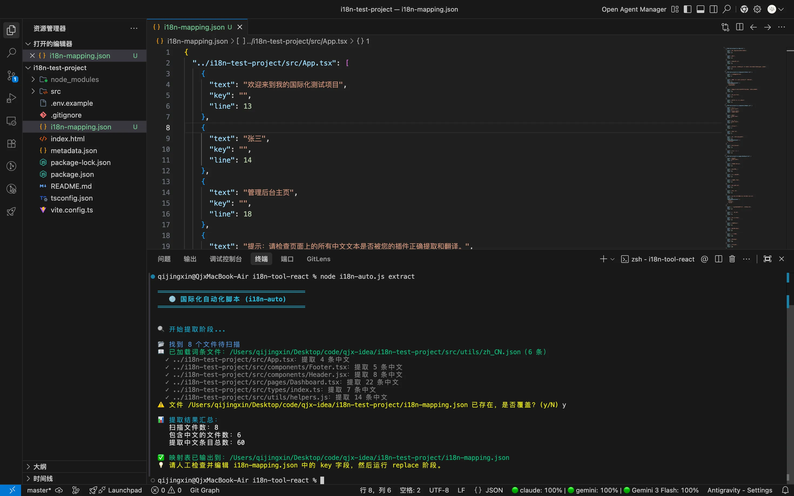

**执行逻辑说明**：

1. 如果之前已经跑过一次生成了映射表文件（默认 `i18n-mapping.json`，可通过 `mappingPath` 配置修改），系统会提示你：是否覆盖旧文件 `(y/N)`。**注意，如果你之前在文件里手动敲过 key 并且还没执行 replace 就重新 extract 覆盖的话，你之前手写的内容会丢失！**
2. 工具会读取你配置的 `existingLocalePath`，加载现有的上千个老词条。
3. 随后逐个扫描分析 `include` 路径里的文件（控制台会打印每个被扫描到了中文的文件）。
4. 跑完后会打印一份**提取结果汇总**（总计多少文件、多少词条）。
5. 最终会在配置的 `mappingPath` 路径下生成核心产物映射表文件（默认为 `i18n-mapping.json`）。

---

## 4. 可视化工作台编排 (UI) — 推荐方式
当映射表条目较多时（几百上千条），直接编辑 JSON 文件效率低且容易出错。工具内置了一个本地可视化配置工作台，让你在浏览器界面中高效完成 key 的填写工作。

在终端运行命令：

```bash
node i18n-auto.js ui
```

工具会自动构建前端并启动本地服务（默认端口 3088），然后自动打开浏览器。

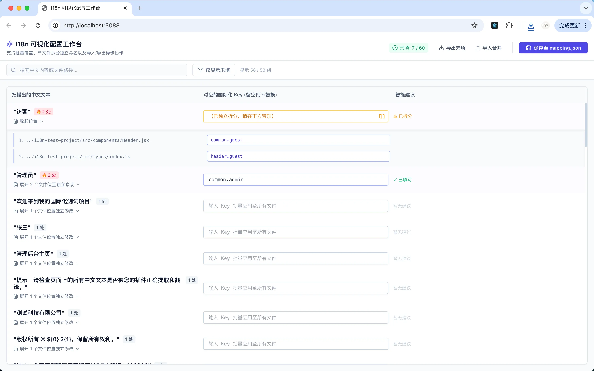

**核心功能说明：**

| 功能 | 说明 |
| --- | --- |
| 🔥 词频聚合排序 | 相同中文自动归组，按出现次数降序排列，高频词优先处理 |
| ✨ 智能建议 | 解析映射表中的 `key1`、`key2` 等候选字段，一键点击即可填入 |
| 🔍 搜索过滤 | 支持按中文内容或文件路径模糊搜索，快速定位目标词条 |
| 📋 仅显示未填 | 一键过滤出所有尚未填写 key 的条目，聚焦待办工作 |
| ✏️ 批量编辑 | 在外层输入框填写 key，自动应用到该中文出现的所有文件位置 |
| 📂 独立编辑 | 展开文件列表，为每个文件位置单独指定不同的 key（拆分场景） |
| 📤 导出未填 | 将所有未填 key 的条目导出为 JSON，方便离线协作分发给其他同事 |
| 📥 导入合并 | 导入他人填好的 JSON，自动合并到当前映射表中 |
| 💾 保存 | 点击保存按钮，数据回写到映射表文件，服务自动关闭 |


**使用建议：**

+ 优先处理高频词（排在最上面），这些词被统一命名后可以批量覆盖多个文件
+ 利用「仅显示未填」快速查看剩余工作量
+ 多人协作时，使用「导出未填 + 导入合并」的工作流分发任务

---

## 5. 人工编排映射表 (Mapping) — 备选方式
映射表文件（默认 `i18n-mapping.json`）是整个流程中**唯一需要你人工处理的文件**。

打开该文件，你会看到按照扫描到的源码文件路径分组的 JSON 列表格式：

```json
{
  "../i18n-test-project/src/App.tsx": [
    {
      "text": "管理后台主页",
      "key": "home.pageIndex",    // 默认如果匹配到已有的就帮你填上了
      "line": 18,
      "key1": "home.pageIndex",
      "key2": "component.pageIndex",
    },
    {
      "text": "提示：请检查页面上的所有中文文本是否被您的插件正确提取和翻译。",
      "key": "",                      // 没有匹配到的词，默认留空
      "line": 25
    }
  ]
}
```

### 这一步你需要做的事：检查并填写 `key` 属性
1. **直接选用候选项 (**`key1`**, **`key2`**...)**：如果你配置了 `multipleKeysForSameText: true`，工具常常会抛出一堆候选 `key`。此时你要检查工具默认填的 `key`（**注意：仅当配置了 **`autoGenerateKey: true`** 时，工具才会自动将最匹配的项填入 **`key`** 属性中**）合不合适。不合适的话就把 `key2` 里的名字复制替换到 `key` 里。
2. **人工造词**：对于完全没有匹配到的纯新词，或者是你将 `autoGenerateKey` 设为 `false` 想要纯人工管控词条名的场景，所有属性里只有带空值的 `"key": ""`。你必须按照团队规范（如 `模块名.功能名.具体词义`）手动发散填入新的键名，如 `"home.pageIndex"`。
3. **剔除脏数据**：如果遇到不该被提取出来的乱码或业务强相关的日志文本。你有两种处理方法：
    - **方法一**：直接在映射表文件里把这个对象的代码块完全删掉。
    - **方法二**：保持它原本的样子，只要它的 `key` 是**空字符串** `""`，待会进入替换阶段，工具就会自动跳过它不替换你的代码。

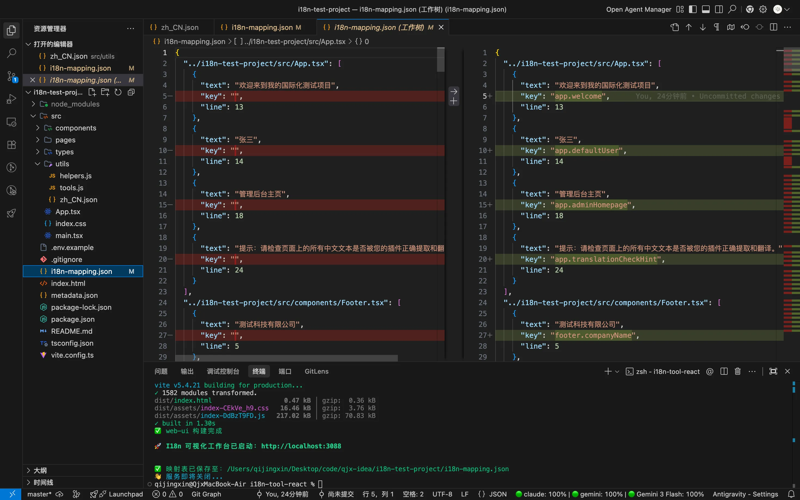

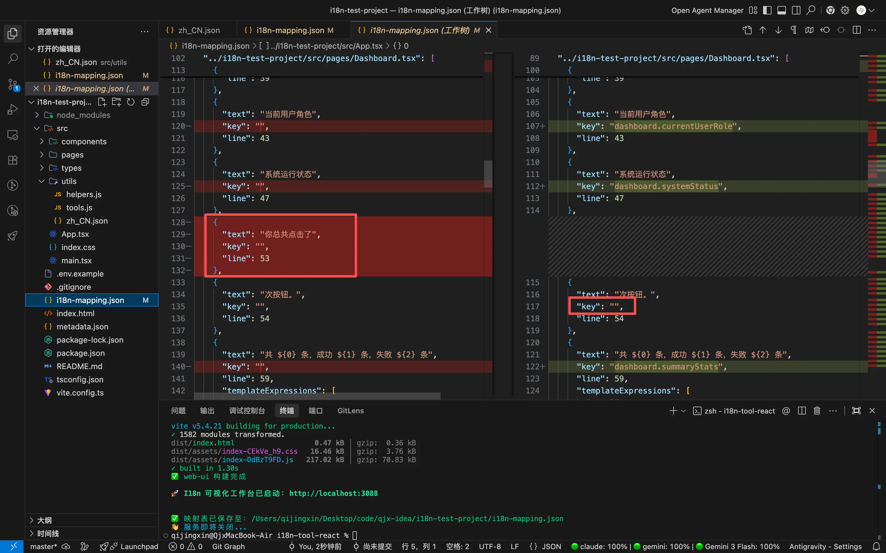

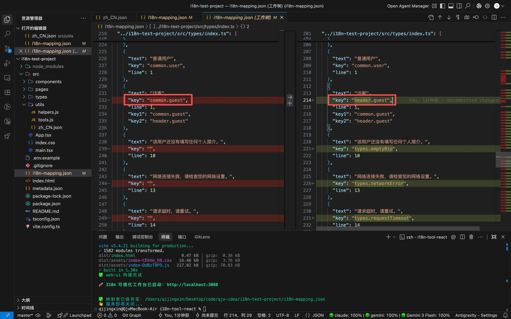

---

## 6. 一键执行替换 (Replace)
在确认映射表文件里你想替换的内容都填好 `key` 后，在终端运行命令：

```bash
node i18n-auto.js replace
```

执行后终端会弹出警告提示：**⚠️**** 注意：此操作将直接修改源代码文件，且不可自动撤销。**  
系统会询问：`是否继续执行替换？(y/N)`。输入 `y` 继续。

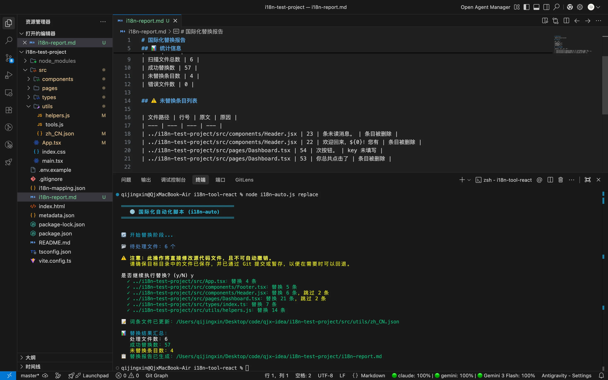

**执行成功后的效果**：

1. **改写你的源码**：
    - 工具会自动识别原代码所处的业务上下文，把它变成：`intl({ key: '...', defaultText: '...' })`
    - 对原本带变量的模板字符串，会自动改写加上 `values: []` 数组映射进去。
2. **头部自动 Inject Import**：
    - 脚本会自动检查这个文件头部有没有 `import` 配置 `importPath` 指定的依赖。
    - 没有的话，会自动在文件最上方插入如：`import { intl } from '@/utils/tools';`。
3. **沉淀新词条**：
    - 所有你在 mapping 阶段自己发明的全新 `key` 和中文映射关系，都会被自动附加追加写入 `outputLocalePath` 指向的 `zh_CN.json` 末尾。
4. **生成审查报告**：
    - reportPath配置的目录会生成一个 `i18n-report.md` Markdown 文件。你可以点开它看到这次都有哪些文件被改了，成功了多少条，或者哪些条因为你忘了填 key 所以被跳过了（`未替换条目`列表），一目了然。

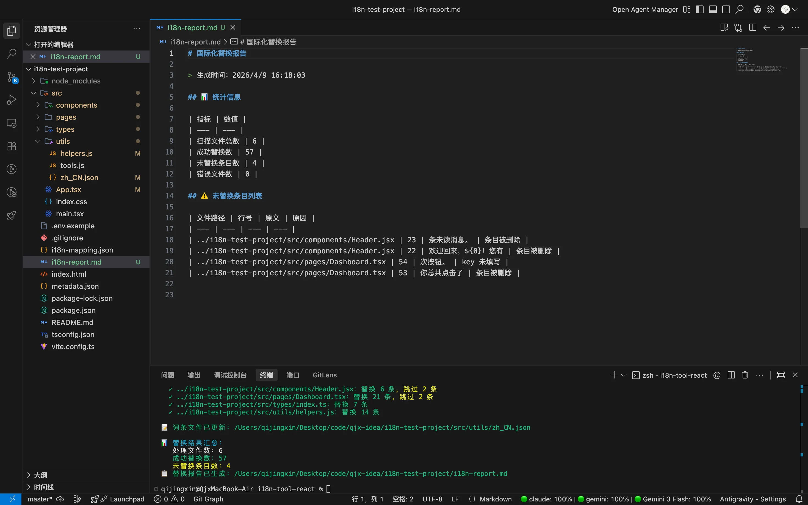

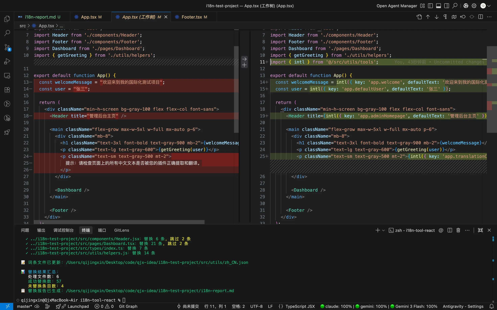

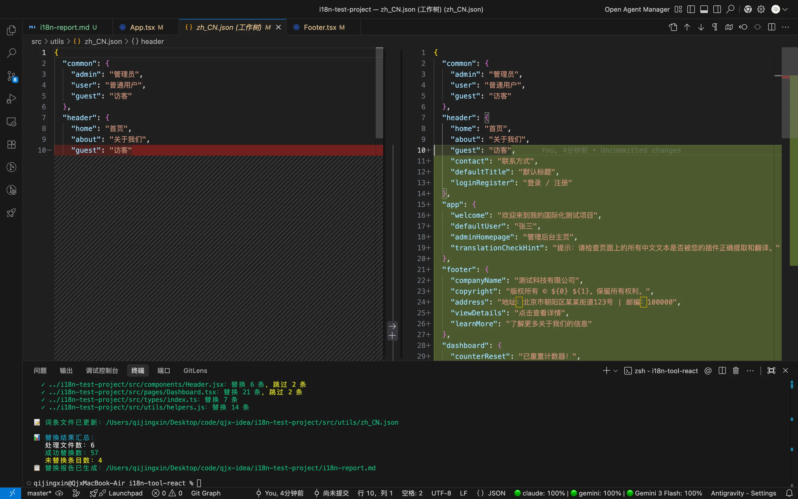

---

## 7. 词条同步阶段 (Sync)
在完成 replace 替换后，或者在日常开发过程中，有时候代码里的 `intl()` 调用中使用的 key 并没有被收录到词条 JSON 文件中（比如手动写了 `intl()` 但忘了往 `zh_CN.json` 里加对应条目）。这会导致运行时翻译缺失，降级为 `defaultText` 兜底显示。

`sync` 命令就是为了解决这个问题：它会**扫描代码中所有已存在的 **`intl()`** 调用**，提取其中的 `key` 和 `defaultText`，然后**与词条 JSON 文件进行对比**，找出缺失的 key 并自动回填。

在终端运行命令：

```bash
node i18n-auto.js sync
```

**执行流程说明：**

1. 工具会加载配置中 `existingLocalePath` 指向的词条文件（如 `zh_CN.json`），并将其扁平化为 key-value 映射。
2. 扫描 `include` 配置目录下的所有源码文件，通过 AST 解析精准提取每一个 `intl({ key: '...', defaultText: '...' })` 调用。
3. 将代码中提取到的 key 与词条文件中已有的 key 进行比对，列出所有缺失的条目。
4. 在终端逐条展示缺失的 key、对应的中文 defaultText，以及它在代码中出现的位置（文件名和行号），方便你快速定位。

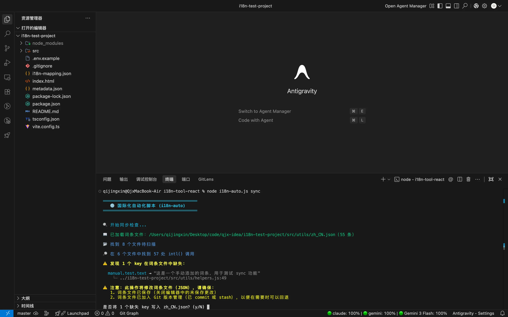

5. 展示完毕后，工具会给出**安全提醒**，请你确保：
    - 词条 JSON 文件已保存（关闭编辑器中的未保存更改）
    - 词条 JSON 文件已加入 Git（已 commit 或 stash），以便出问题时可以回退
6. 确认输入 `y` 后，工具会将所有缺失的 key 按嵌套结构写入词条 JSON 文件。

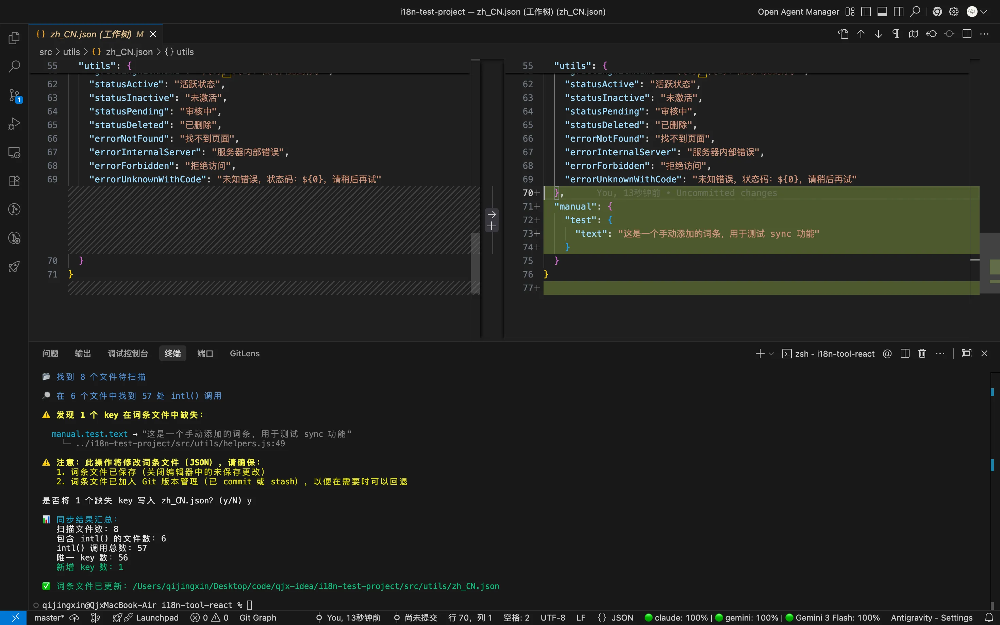

**使用场景示例：**

+ 执行完 `replace` 后，词条文件中可能缺少部分新增的 key，此时运行 `sync` 可以一次性补全。
+ 开发过程中手动在代码里写了 `intl({ key: 'xxx.yyy', defaultText: '某某' })`，但忘了在 JSON 文件里登记，`sync` 能帮你自动发现并补上。
+ 团队协作中，多人同时改造不同模块，最终合并后可能出现 JSON 和代码不一致的情况，`sync` 可作为兜底检查手段。

---

## 8. 自定义 `intl` 方法实现 (实操建议)
**重要说明**：脚本只是帮你对代码结构进行替换重组，它假定你在项目底层配置的路径（譬如 `importPath: '@/utils/tools'`）里，真实导出了一个名为 `intl`（根据配置项 `translateFuncName` 改变）的函数。

如果你所在的旧项目中之前并没有封装这样的标准化方法，你需要找到项目的 utils 或公共工具包目录，补充以下类似代码：

```javascript
const i18n = window?.xxx_i18n ? window.xxx_i18n : (_key, defaultText) => { return defaultText };

/**
 * 国际化翻译函数
 * 通过 key 从词条文件中获取翻译文本，并将 ${0}、${1}... 占位符替换为实际值
 *
 * @param {object} params - 翻译参数
 * @param {string} params.key - 词条 key，如 'common.confirm'
 * @param {string} params.defaultText - 默认文本，当 key 未匹配到词条时使用
 * @param {Array} [params.values] - 变量值数组，按顺序替换文本中的 ${0}、${1}... 占位符
 * @returns {string} 翻译后的文本
 *
 * @example
 * // 普通翻译
 * intl({ key: 'common.confirm', defaultText: '确认' })
 * // → "确认"（或对应语言的翻译）
 *
 * @example
 * // 带变量的翻译
 * intl({ key: 'order.summary', defaultText: '共 ${0} 条，成功 ${1} 条', values: [100, 98] })
 * // → "共 100 条，成功 98 条"
 */
export const intl = ({ key, defaultText, values }) => {
  // 通过 i18n 获取翻译文本，如果没有匹配到则使用 defaultText
  const text = i18n(key, defaultText) || defaultText;

  // 如果没有变量需要替换，直接返回
  if (!values || values.length === 0) {
    return text;
  }

  // 将 ${0}、${1}、${2}... 占位符替换为 values 中对应的值
  return text.replace(/\$\{(\d+)\}/g, (match, index) => {
    const i = parseInt(index, 10);
    return i < values.length ? values[i] : match;
  });
};
```

---

## 9. 常见解答说明 (FAQ)
### ❓ 为什么在 `intl` 替换的函数里，一定会强行保留 `defaultText` 字段？
这是故意设计的最佳实践，主要基于以下两大考虑：

1. **代码可搜索性（极度重要）**：改造后，虽然代码被包了一层函数，但**原始的中文仍然以明文形式保留在 **`defaultText`** 中**。这意味着当接盘的同事或者未来的你需要在茫茫工程里定位某个弹窗的报错源码时，依然可以通过 IDE 原封不动地**直接全局搜索中文文本**。如果不保留，满屏幕都是干瘪的 `intl("common.confirm")`，排查业务代码会变成一场灾难。
2. **安全容错机制**：当词条库拉取失败、别人忘配 JSON 词条，或者新版本环境还没发布翻译包时，底层 `intl` 工具如果提取不到对应远端文本，可以直接优雅地降级 fallback 渲染回 `defaultText` 的中文字符串常量，让前端页面绝不出现空壳或丑陋的英文 key 首字母兜底。

### ❓ 为什么有些中文字符串没有被工具扫描出来？
可能该字符串被用在了配置里的 `exclude` 忽略名单、也或者是包裹在 `console.log()` 里、以及最常见的 `===`** 或者是 `switch/case` 逻辑判断表达式** 中。  
在日常国际化改造中，逻辑判断类的硬编码中文（如状态字符串判断）强烈推荐改为枚举常量字典，如果工具把这些也套一层 `intl()`，代码大概率就跑不通了所以被故意放过不扫。

### ❓ 提取带变量的模板时，里面的 `${0}` 是什么意思？
当业务代码是 ``` 修改量：${count} ``` 的 ES6 模板字符串语法时，AST 解析会将这种含有非中文动态变量的连续整体，合并成为保留了 `${数字}` 占位序数的模板语段。替换到代码后，真实的变更值会被填充在这个词条调用的 `values` 属性数组里。**它能有效避免完整的中文自然长句被前端变量切得支离破碎，进而方便外语母语者去通顺地做倒置句等相关语言翻译。**

### ❓ 运行 replace 后代码报错？
因为使用 AST 做了一定程度深度修改与插入。在个别极端复杂的深层解构判断或非标准语法的奇葩代码结构中，它替换生成的代码可能偶尔会丢失一个括号或分号规范。  
所以在替换完成后，**千万记得打开 VSCode/IDE 的 Git 修改视图面板，或者随便用肉眼扫一遍发生变更的文件，并在提交前务必确保页面跑一遍没报错。** 有配置 Lint 工具的项目执行一遍 `npm run lint` 验证最佳。

### ❓ sync 命令和 replace 命令有什么区别？
两者职责不同：

+ `replace` 是**改代码**——把源码中的中文字符串替换为 `intl()` 调用，同时把新词条追加到 JSON 文件。
+ `sync` 是**补词条**——它不修改任何源代码，只扫描代码中已经存在的 `intl()` 调用，检查其 key 是否在 JSON 文件中注册。如果缺失，就把 `defaultText` 作为值回填进去。

典型的使用场景：在 `replace` 之后运行 `sync` 做兜底检查，或者在多人协作后用它来对齐代码和词条文件。

### ❓ sync 会覆盖 JSON 文件中已有的词条吗？
不会。`sync` 只会**新增**缺失的 key，已经存在的 key 及其值不会被修改或覆盖。所以你可以放心地反复运行它。

